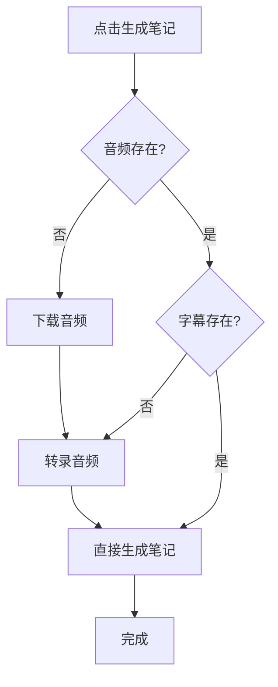

# Auto Notes 使用指南（解耦架构版）

## 快速开始

### 1. 启动服务器

```bash
cd Auto_Notes
python auto_study_server.py
```

看到以下提示表示启动成功：

```
服务已启动 (重构版)，正在监听 5000 端口...
```

### 2. 安装浏览器脚本

1. 安装 [Tampermonkey](https://www.tampermonkey.net/) 浏览器扩展
2. 打开 `sjtu_video_helper.js`
3. 复制全部内容
4. 在 Tampermonkey 中创建新脚本并粘贴
5. 保存

### 3. 访问课程网站

访问 SJTU Canvas 课程网站，脚本会自动检测视频并显示面板。

---

## 功能说明

### 面板按钮

| 按钮            | 功能           | 说明                     |
| --------------- | -------------- | ------------------------ |
| 🤖 生成 AI 笔记 | 智能一键生成   | 自动判断需要的步骤并执行 |
| 🎵 下载音频     | 下载音频文件   | 可选择是否转录           |
| 📝 转录音频     | 仅转录已有音频 | 需要音频文件已存在       |
| 🎬 下载视频     | 下载完整视频   | 保存为 MP4 格式          |
| 📋 复制链接     | 复制视频链接   | 用于手动处理             |
| 🗑️ 清空完成     | 清空已完成任务 | 清理任务列表             |

---

## 使用场景

### 场景 1：完整流程（首次处理课程）

**目标**：下载音频 → 转录 → 生成笔记

**步骤**：

1. 播放课程视频
2. 点击"🤖 生成 AI 笔记"
3. 等待自动完成所有步骤

**流程**：

```
检测文件状态
  → 音频不存在？下载音频
  → 字幕不存在？转录音频
  → 调用 Gemini 生成笔记
  → 保存到 Obsidian
```

**时间**：约 3-5 分钟（55 分钟课程）

---

### 场景 2：仅下载音频

**目标**：下载音频文件到本地，暂不处理

**步骤**：

1. 播放课程视频
2. 点击"🎵 下载音频"
3. 选择是否立即转录

**文件位置**：`D:\Download\SJTU_Courses\课程名-日期-时间.m4a`

---

### 场景 3：重新转录（音频已存在）

**目标**：音频已下载，需要重新转录字幕

**步骤**：

1. 点击"📝 转录音频"
2. 如果字幕已存在，确认是否覆盖
3. 等待转录完成

**适用情况**：

-   转录失败需要重试
-   更换了更好的 ASR 模型
-   调整了转录参数

---

### 场景 4：重新生成笔记（字幕已存在）

**目标**：字幕已转录，只需重新生成笔记

**步骤**：

1. 点击"🤖 生成 AI 笔记"
2. 系统检测到字幕存在，直接生成笔记

**适用情况**：

-   优化了 Gemini prompt
-   笔记不满意需要重新生成
-   笔记文件丢失

**时间**：约 1-2 分钟

---

### 场景 5：批量下载多节课

**方法 A：逐个点击（推荐）**

1. 打开第一节课视频
2. 点击"🎵 下载音频"，选择"稍后转录"
3. 切换到第二节课
4. 重复步骤 2
5. 所有下载完成后，逐个转录

**方法 B：使用命令行（高级）**

编辑 `run_workflow.py`：

```python
urls = [
    "https://课程1.mp4",
    "https://课程2.mp4",
    "https://课程3.mp4",
]
```

运行：

```bash
python run_workflow.py
```

---

## 智能判断逻辑

### 点击"生成 AI 笔记"时

系统会自动检查文件状态并执行必要步骤：



**优势**：

-   ✅ 自动跳过已完成步骤
-   ✅ 避免重复下载/转录
-   ✅ 节省时间和资源
-   ✅ 支持断点续传

---

## 文件结构

### 下载目录

```
D:\Download\SJTU_Courses\
├── 程序语言与编译原理-1017-0855.m4a      # 音频文件
├── 程序语言与编译原理-1017-0855.srt      # SRT 字幕
├── 程序语言与编译原理-1017-0855.txt      # TXT 逐字稿
├── 计算机网络-1018-1000.m4a
└── ...
```

### Obsidian 笔记目录

```
D:\OneDrive\Obsidian\
├── 程序语言与编译原理\
│   ├── 程序语言与编译原理-1017-0855.md
│   ├── 程序语言与编译原理-1024-0800.md
│   └── ...
├── 计算机网络\
│   └── ...
```

---

## 任务管理

### 任务状态

| 状态      | 说明               | 操作   |
| --------- | ------------------ | ------ |
| ⏳ 排队中 | 任务已加入队列     | 可取消 |
| 📥 下载中 | 正在下载音频/视频  | 可取消 |
| ⚙️ 处理中 | 正在转录或生成笔记 | 可取消 |
| ✅ 已完成 | 任务成功完成       | 可删除 |
| ❌ 失败   | 任务执行失败       | 可删除 |
| 🚫 已取消 | 用户取消任务       | 可删除 |

### 取消任务

1. 点击任务右侧的 **✕** 按钮
2. 确认取消
3. 任务会停止执行并清理临时文件

### 删除任务

1. 已完成/失败的任务，右侧按钮变为 **🗑**
2. 点击删除按钮
3. 任务从列表中移除

### 清空已完成任务

点击面板底部的"🗑️ 清空完成"按钮，批量清理所有已完成/失败的任务。

---

## 故障排查

### 问题 1：面板未出现

**原因**：页面未检测到视频

**解决**：

1. 播放视频
2. 等待 2-3 秒
3. 刷新页面

---

### 问题 2：下载失败

**可能原因**：

-   网络问题
-   视频链接失效
-   FFmpeg 未安装

**解决**：

1. 检查网络连接
2. 重新播放视频获取最新链接
3. 确认 FFmpeg 已安装：
    ```bash
    ffmpeg -version
    ```

---

### 问题 3：转录失败

**可能原因**：

-   音频文件损坏
-   模型未正确配置
-   内存不足

**解决**：

1. 检查音频文件是否完整
2. 查看服务器日志
3. 确认 `asr_config.json` 配置正确
4. 检查 GPU 显存（如使用 CUDA）

---

### 问题 4：笔记生成失败

**可能原因**：

-   Gemini API Key 无效
-   网络超时
-   字幕文件为空

**解决**：

1. 检查 `GOOGLE_API_KEY` 环境变量
2. 配置代理（如在限制网络）
3. 查看字幕文件内容是否正常

---

### 问题 5：任务卡住不动

**解决**：

1. 取消卡住的任务
2. 重启服务器：
    ```bash
    # Ctrl+C 停止服务器
    python auto_study_server.py
    ```
3. 刷新浏览器页面
4. 重新提交任务

---

## 性能优化

### 转录速度

**当前配置**（最优）：

-   Beam Size: 3
-   模型缓存: 启用
-   VAD 过滤: 启用

**55 分钟音频**：

-   转录时间：~1.5 分钟
-   速度：325 字符/秒

**如需更快**（略降准确度）：

```bash
# .env
FASTWHISPER_BEAM_SIZE=1
```

**如需更准确**（较慢）：

```bash
# .env
FASTWHISPER_BEAM_SIZE=5
FASTWHISPER_INITIAL_PROMPT="这是一段包含专业术语的中文课程音频。"
```

---

### 并发处理

**当前配置**：4 个并发 worker

**调整并发数**：

```bash
# .env
WORKER_COUNT=8  # 增加到 8 个
```

⚠️ **注意**：

-   更多 worker 会占用更多内存
-   每个 worker 共享同一个 ASR 模型实例
-   推荐值：CPU 核心数 - 1

---

### 文件复用

**自动跳过已有文件**：

-   下载前检查音频是否存在
-   转录前检查字幕是否存在
-   生成笔记前检查所有前置条件

**手动管理**：

-   删除不完整的文件重新下载
-   删除字幕文件重新转录
-   删除笔记重新生成

---

## 高级功能

### API 直接调用

参见 `API_DOCUMENTATION.md`

示例：

```python
import requests

# 检查文件
response = requests.post(
    "http://localhost:5000/check-files",
    json={
        "courseName": "程序语言与编译原理",
        "lessonTitle": "2025-10-17 08:55 程序语言与编译原理"
    }
)
file_status = response.json()
```

---

### 批量测试

运行测试脚本：

```bash
python test_api.py
```

测试内容：

-   ✅ 服务器连接
-   ✅ 文件检查
-   ✅ 转录功能
-   ✅ 笔记生成
-   ✅ 任务管理

---

## 常见问题

### Q1: 如何只下载不转录？

A: 点击"🎵 下载音频"，在弹窗中选择"稍后转录"。

### Q2: 如何重新生成笔记但不重新转录？

A: 直接点击"🤖 生成 AI 笔记"，系统会检测到字幕存在，直接生成笔记。

### Q3: 如何批量处理多个课程？

A: 使用 `run_workflow.py` 脚本，或编写自定义脚本调用 API。

### Q4: 转录太慢怎么办？

A:

1. 确认使用 GPU（`FASTWHISPER_DEVICE=cuda`）
2. 降低 beam_size 为 1
3. 检查模型缓存是否启用

### Q5: 笔记质量不满意？

A:

1. 修改 `core_processor.py` 中的 `SYSTEM_PROMPT`
2. 调整 Gemini 参数（temperature, max_tokens）
3. 重新生成笔记

### Q6: 如何备份已有文件？

A: 复制以下目录：

-   音频/字幕：`D:\Download\SJTU_Courses\`
-   笔记：`D:\OneDrive\Obsidian\`

### Q7: 如何迁移到新电脑？

A:

1. 复制整个 `Auto_Notes` 目录
2. 复制下载目录和 Obsidian 目录
3. 安装依赖：`pip install -r requirements.txt`
4. 配置环境变量（`.env`）
5. 下载 Faster-Whisper 模型

---

## 技术支持

-   **文档**：查看 `Auto_Notes/` 目录下的 Markdown 文档
-   **日志**：查看服务器控制台输出
-   **测试**：运行 `python test_api.py`
-   **性能**：参考 `PERFORMANCE_OPTIMIZATION.md`

---

## 更新日志

### v2.0 - 解耦架构（当前版本）

**新功能**：

-   ✅ 智能文件检查
-   ✅ 独立步骤执行（下载/转录/笔记）
-   ✅ 文件复用机制
-   ✅ 智能流程控制
-   ✅ 增强的任务管理
-   ✅ 新增"转录"按钮

**改进**：

-   ✅ 优化转录速度（beam_size=3）
-   ✅ 模型缓存机制
-   ✅ 更好的错误提示
-   ✅ 更灵活的工作流

**兼容性**：

-   ✅ 保留旧版一键流程
-   ✅ 无需修改配置
-   ✅ 自动迁移

---

**最后更新**: 2024-11-24  
**版本**: v2.0  
**状态**: ✅ 生产就绪
